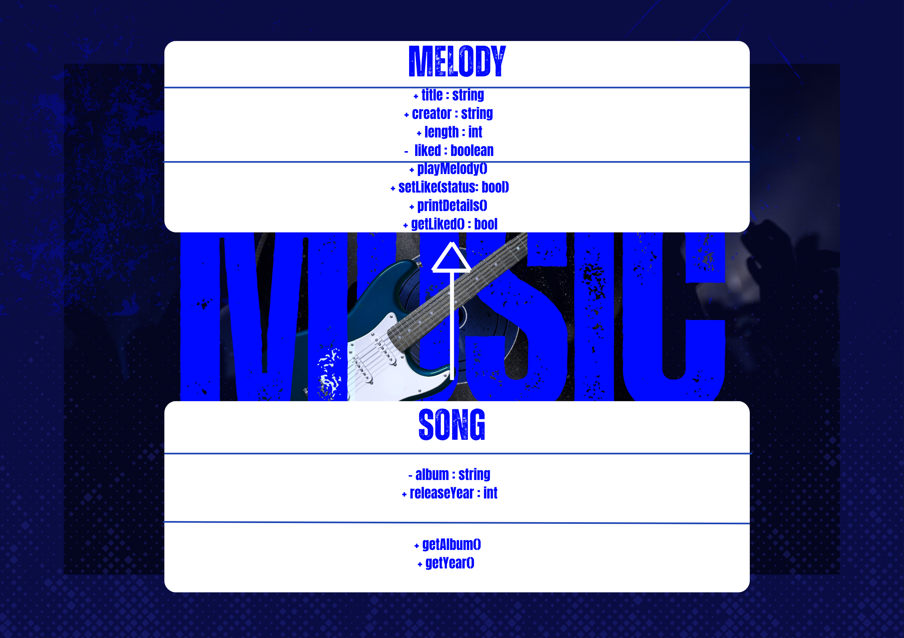
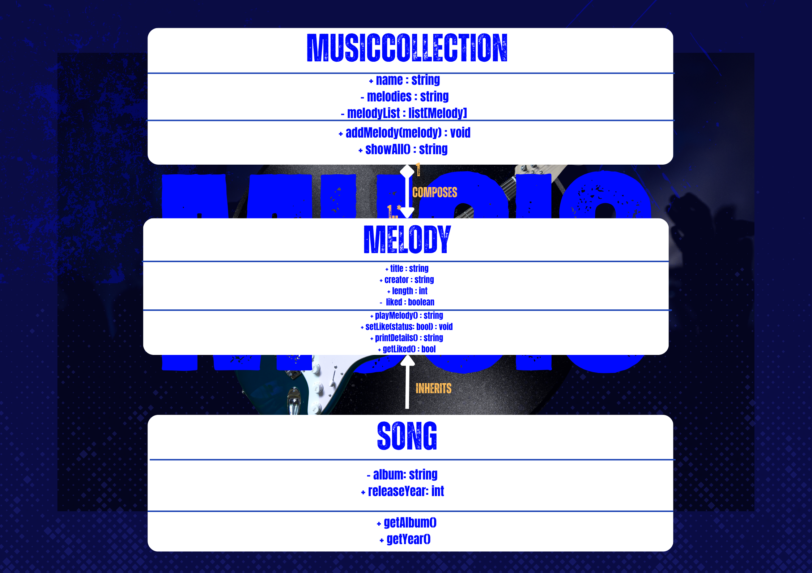
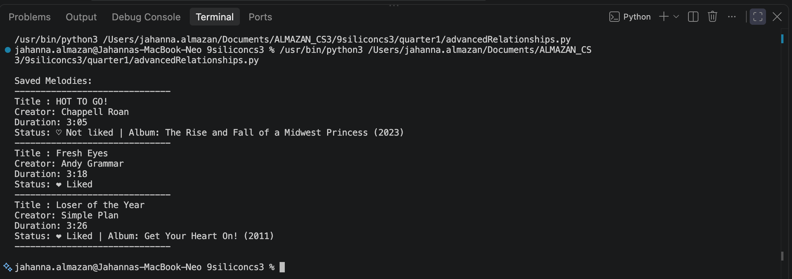
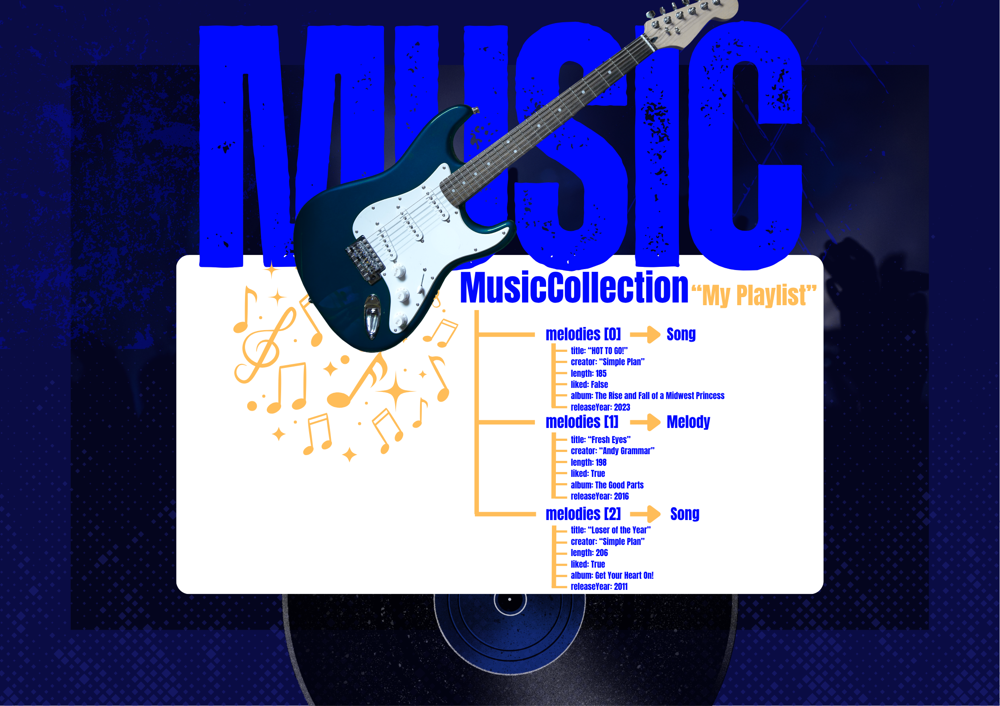

# Advanced Class Relationships

## Previous Activities
[Part I - Classes & Objects](classObjectUML.md)
[Part II - Class Attributes and Methods](classAttributesMethods.md)
[Part III - Class Relationships](classRelationships.md)

## Existing System Description:
My system has two classes. Melody represents one song with title, creator, length in seconds, and liked status. It can play, print details, set and get like status of the song. MusicCollection holds many Melody objects in a list. It can add a melody and show all saved melodies together.

### What classes currently exist in your system?
Class 1: Melody
Class 2: MusicCollection

### What problem or limitation exists in your current design?
: All melody items share the same basic details such as title, creator, and length but there is no shared parent class to hold these common features. Any new type of song would repeat the same attributes and methods again. This creates duplicate code and makes updates harder later.

## Inheritance Relationship
Parent: Melody
Child: Song
Explanation: A Song IS-A Melody because it is still a musical piece with a title, creator, length, and liked status. It simply adds more specific details like album name and year of release. Every Song is a Melody but not every Melody has album information.

## Inheritance UML

## Composition/Aggregation
 Relationship | The class containing another object | The contained object |
|---|---|---|
| Composition | MusicCollection | Melody |

Explanation: MusicCollection strongly owns its melodies. If you delete the collection, all the melodies inside it are removed from the system too. They do not exist separately oustide that collection in this design.

## Advanced UML Diagram

## Python Implementation
[Source Code](advancedRelationships.py)

## Test Run

## Object Diagram

## Reflection
### 1. Why did you choose your inheritance relationship? Explain why your child class is a type of your parent class.
: I chose Melody as the parent class and Song as the child class because a song is a specific type of melody. Every song has all the basic melody features plus extra details like album and release year. This lets me share what is common while adding only what is different.

### 2. How did inheritance reduce duplicate code? Identify attributes or methods that were reused.
: I reused title, creator, length, like status, and all the methods like playMelody and setLike directly from Melody. I did not have to rewrite any of them in Song. This removes repeating the same code twice and keeps everything in one place.

### 3. Why is your HAS-A relationship Composition or Aggregation? Explain the lifecycle relationship between the two objects.
: MusicCollection creates and owns its melodies. The melodies exist only inside that collection in this system. If the collection is removed, those stored melodies will be removed as well. They do not exist independently.

### 4. What is the difference between Association from Part III and the advanced relationship you implemented?
: Association only connected the classes without saying which owns what. Composition makes it clear that MusicCollection owns the melodies and controls their lifecycle. It shows ownership instead of just a connection.

### 5. How does your design follow the DRY principle?
: The DRY principle, "Don't Repeat Yourself", means writing the shared code once. All common melody features live in Melody. Songs add only what is new. Any change to how a melody works happens in once place and automatically applies to every child class.