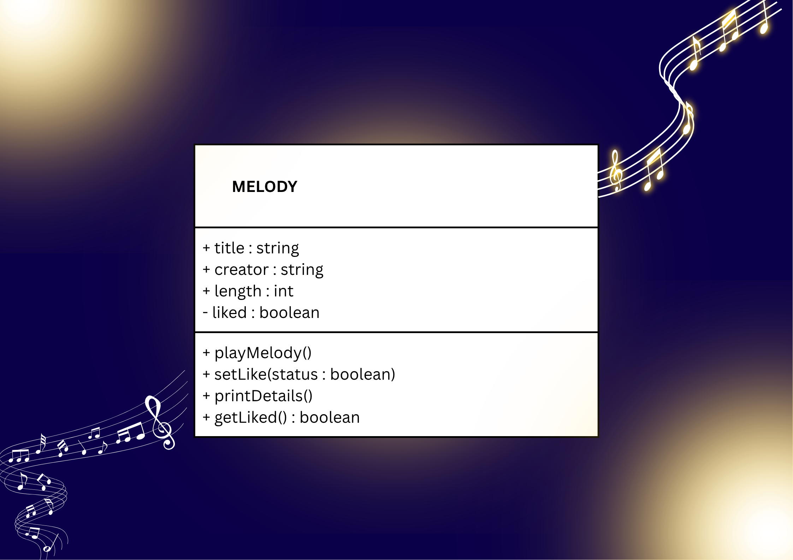
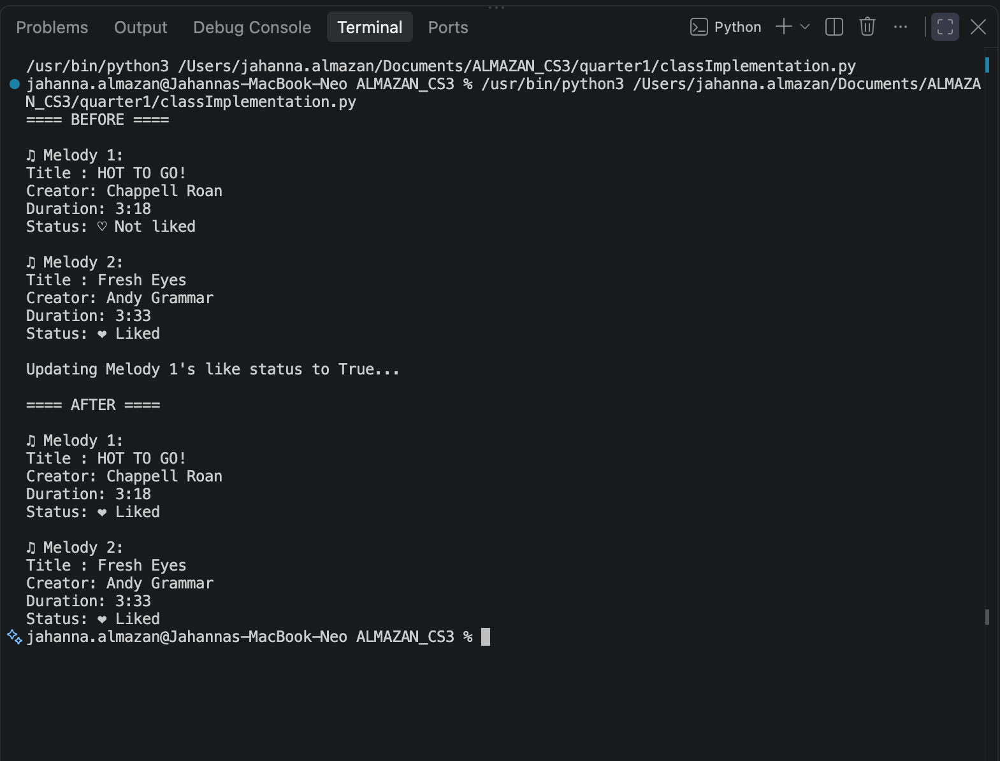
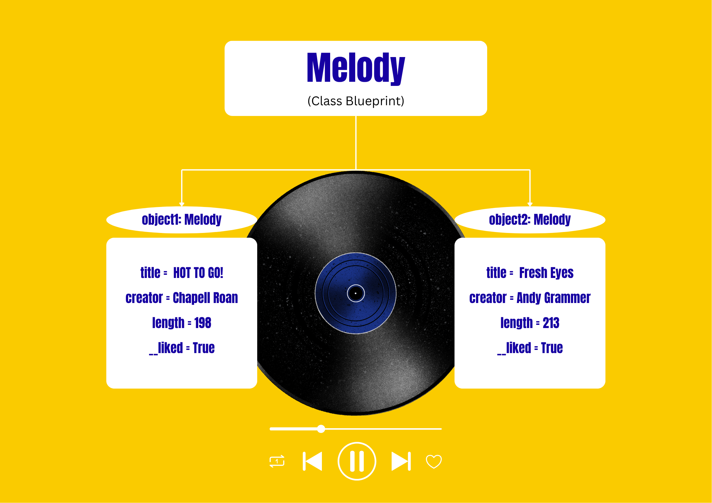

# Class Attributes and Methods

## Previous Design
Link to my previous activity:
[classObjectUML.md](quarter1/classObjectUML.md)

## Design Revision
I renamed the property like to liked for clarity and consistency with the method name setLike(). No other major changes were needed since the original design fits well.

## Visibility Decisions
| Attribute | Data Type | Visibility | Why Public/Private? |
|---|---|---|---|
| title | string | Public | The name of a melody can be easily read and changed. |
| creator | string | Public | The composer or artist info can be shown or updated. |
| length | int | Public | The duration in seconds can be displayed and adjusted. |
| liked | boolean | Private | The liked status can only be changed through setLike() so it cannot be accidently set to an invalid value. |

## Updated UML Class Diagram

## Python Implementation
[View Python Source](quarter1/classImplementation.py)
## Test Run

## Object Diagram

## Analysis
### Why did you make your chosen attribute private?
: I made my chosen attribute, which is liked, private so it cannot be changed incorrectly or randomly. If anyone altered it directly it might get wrong data like words or numbers instead of True or False. Protecting it means only the proper method can update it and keep the melody data reliable.

### Which method changes the state of your object?
: The setLike method changes the object's state. It affects the liked attribute and updates whether the melody is marked as liked. It also checks the value first so the update happens safely and correctly.

### How did your two objects demonstrate that instances are independent?
: I changed only Melody 1 to liked and it updated right away. Melody 2 stayed just the same with no changes at all. This shows each melody holds its own information and one does not automatically change the other.

### What is the difference between your class diagram and your object diagram?
: The class diagram is the design plan that lists what attributes exist and their types. It does not hold real information. The object diagram shows actual copies made from that plan with real titles, creators, and values. The former describes the structure while the latter shows the information.