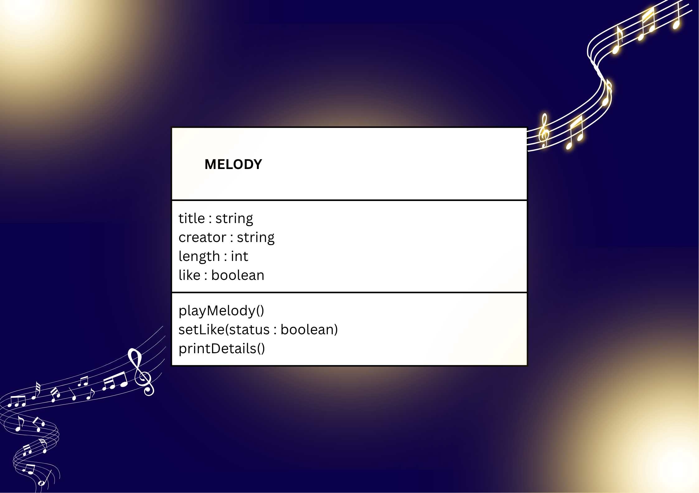

# SG4 - Understanding Classes and Objects
## Melody
## My class represents a single musical piece in a music collection, and it is commonly associated with music. It stores essential song details and defines the actions a user can perform with it.

## Properties
| Property | Data Type | Description |
|---|---|---|
| title | string | The name of the melody |
| creator | string | The composer or artist who made it |
| length | int | The duration of the melody in seconds |
| like | boolean | It shows whether the melody is marked as liked |

## Methods
| Method | Description |
|---|---|| | |
| playMelody() | It starts playing the melody from the beginning |
| setLike(status:boolean) | It updates whether the melody is marked as liked |
| printDetails() | It displays all stored information about this melody |

## Class Diagram

## Design Explanation
### Why did you choose this class?
### : I chose Melody because music is something I enjoy. Other reasons why I chose this class is because I like singing, and the name Melody captures the feeling of what matters most in a piece. It fits naturally with how I feel and connect with music.
### Which property is the most important? Why?
### : The title is the most important property. It is what catches attention and what the user remembers most clearly. Even if the user forgets the exact length or creator, the title is what reminds them of the piece they want.
### Which method is the most useful? Why?
### : printDetails() is the most useful method. It shows all key information in one view. It displays the title, creator, length, and whether it is liked. Instead of checking separately, the user can see everything at once, which keeps things simple and organized.
