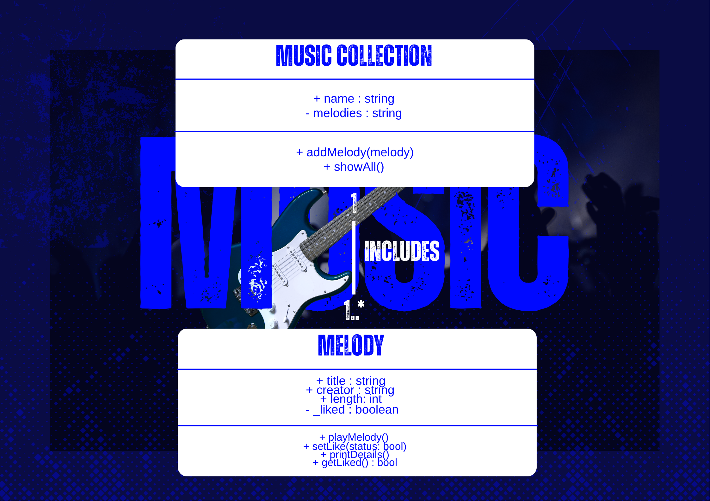
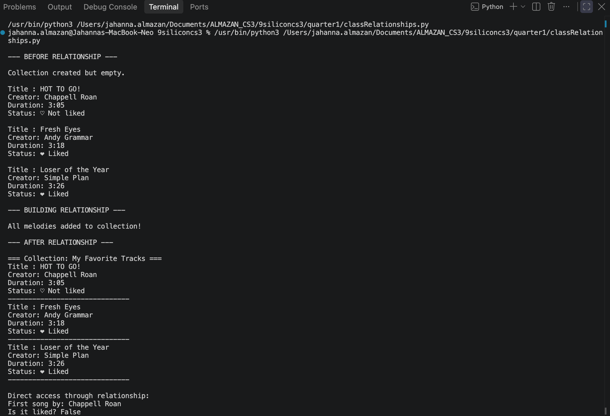

# Class Relationships: Association and Multiplicity

## Previous Works
[Part I - Classes and Objects](classObjectUML.md)

[Part II - Class Attributes and Methods](classAttributesMethods.md)

## Existing Class
Class: Melody
Description: It represents a single musical piece. It stores details like title, creator, length, and whether it is marked as liked. It also defines actions you can do with the song.

## New Related Class
Class: MusicCollection
Description: A personal folder or group that gathers and organizes melodies you love or want to keep together. It holds and manages your songs in one place.

## Association
Relationship: MusicCollection includes Melody
Explanation: A music collection exists to hold songs. One collection can contain many melodies, and each melody belongs to that collection.

## Multiplicity
Multiplicity: 1..* (One-to-Many)
Explanation: There is one collection, and it can hold one or more melodies inside it. This fits because you have one collection, but you can always add more songs to it.

## UML Class Relationship Diagram

## Python Implementation
[View Python Source](classRelationships.py)

## Test Run

## Object Relationship Diagram

## Analysis
### What is the association between your two classes?
: MusicCollection includes and organizes Melody objects. Every song you save belongs to this collection, and it holds them all together so you can view or manage them as a group.
### What multiplicity did you choose and why?
: I chose One-to-Many. One collection can hold on or more melodies. This fits perfectly because you have one collection, but you can keep adding new songs whenever you want.
### How did you implement the relationship in Python?
: I used self.melodies = [] inside MusicCollection. The method addMelody() takes a   Melody object and adds it to that list.
### Why did you store an object reference instead of copying its data?
: Storing the whole Melody object means I can access anything about it without copying or re-typing info. For example, my_collection.melodies[1].title gets the title right from the connected object.
### If your relationship uses many, why is a list appropriate?
: A list is perfect here because it holds many items in order. It stores Melody objects, so I can loop through them and call methods like printDetails() on every single one.
